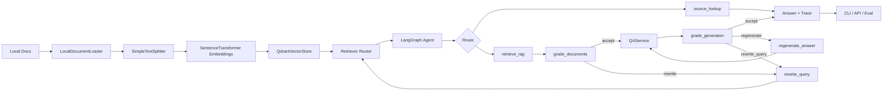

# llm_doc_rag_agent 项目复盘

这份文档用于把 `llm_doc_rag_agent` 讲成一个适合 Agent/RAG 方向实习的项目实践。重点不是继续堆企业级能力，而是把已实现的工程链路、技术取舍和可复盘难点讲清楚。

## 项目定位

`llm_doc_rag_agent` 是一个面向本地技术文档的 RAG Agent。它把 notebook 学习阶段的 RAG、Qdrant 检索评估、LangGraph 编排能力，整理成可复用的 Python 工程：

一句话版本：我实现了一个本地技术文档 RAG Agent，支持文档索引、Qdrant 持久化、dense/BM25/hybrid 检索、LangGraph 自适应路由、CRAG/Self-RAG 质量闭环和实验评估输出。

## 1 分钟讲解稿

这个项目是一个本地技术文档 RAG Agent，目标是把分散的学习 notebook 改造成一个可复用的工程项目。主链路是：先用 loader 读取用户指定的本地文档，按固定规则切块，使用 SentenceTransformer 生成 embedding，然后写入本地 Qdrant collection。查询时由 retriever router 选择 dense、BM25 或 hybrid RRF 检索策略，再交给 LangGraph 做路由：如果用户问的是 sources 或 chunks，就直接走 source lookup；如果是普通问题，就走 retrieve RAG 分支。RAG 分支里我加了 CRAG gate，检索结果不够相关时会改写 query 并重试；生成后再由 hybrid/LLM judge 判断答案是否 grounded 和 relevant，合格才结束，不合格则重答或回到检索链路。整个项目还提供 CLI、可选 API、eval runner 和单元测试，所以它不是单个 demo 脚本，而是一个能解释工程边界和技术取舍的 RAG/Agent 实践项目。

## 3-5 分钟架构讲解

可以按四层来讲：

1. 数据与索引层  
   `LocalDocumentLoader` 只读取用户显式传入的路径，并通过 `.ragignore` 跳过 `.env`、key、索引目录、实验输出等敏感或生成文件。切块后保留 `source_path`、`chunk_index`、`content_hash` 等元数据，方便引用、删除 source 和增量索引。

2. 检索层  
   Dense 检索负责语义召回，BM25 负责配置项、函数名、命令、错误码等精确词召回，Hybrid RRF 用 reciprocal rank fusion 合并两类结果。Reranker 做成可插拔入口，默认不加载 CrossEncoder，避免项目在本地环境里变得过重。

3. Agent 编排层  
   LangGraph 不只是包一层 `retrieve -> generate`，而是先做 `route_question`。source lookup 类问题不调用 embedding 和 LLM，普通问题进入 `retrieve -> grade_documents -> generate -> grade_generation`。生成后 judge 可以选择 `accept`、`regenerate` 或 `rewrite_query`，所以 trace 能解释“为什么走这条路径”，也能展示 Agent 的控制流。

4. 评估与工程入口  
   CLI/API/eval 都复用 `RagService`，避免重复业务逻辑。Eval 支持多 retriever 对比并生成 Markdown 报告；测试覆盖 loader、chunking、retrieval、service、graph rewrite 和 insufficient context 分支。

## 4 个核心技术亮点

1. 增量索引与安全边界  
   用 `document_hash` 判断 source 是否变化，未变化文件不会重复 embedding；`.ragignore` 默认跳过敏感文件和生成目录。这体现了本地文档 RAG 项目必须考虑的隐私和重复索引成本。

2. Dense/BM25/Hybrid 检索对比  
   Dense 适合语义问题，BM25 适合精确 token，Hybrid RRF 兼顾两者。项目没有只停留在“向量库查 top-k”，而是做了检索策略路由和 eval 对比入口。

3. LangGraph Adaptive Routing  
   graph 入口根据问题类型走 `source_lookup`、`direct_answer` 或 `retrieve_rag`。这让元数据查询不需要无意义地调用 LLM，也让普通 RAG 问答有清晰的节点路径。

4. CRAG/Self-RAG 质量闭环  
   `grade_documents` 根据 query terms、检索分数和可选 LLM judge 判断上下文是否可用，不足时进入 `rewrite_query` 重试；`grade_generation` 会判断答案是否 grounded/relevant，并决定直接结束、带反馈重答，或改写 query 后重新检索。

## 实现中可以复盘的难点

- 如何从 notebook 迁移到工程模块：学习代码通常是线性流程，工程项目需要拆成 loader、splitter、embedding、store、retriever、agent、service、CLI/eval。
- 如何避免重复索引：需要在 source 维度记录内容 hash，并在文件变更时先删除旧 chunks 再写入新 chunks。
- 如何处理不同检索策略的分数不可比：dense、BM25、hybrid 分数尺度不同，所以 graph 的相关性判断不能直接假设所有分数含义一致。
- 如何控制 Agent 不强答：当检索不到足够上下文，或生成后 judge 仍不通过预算时，系统要能返回 insufficient context，而不是让 LLM 硬编。
- 如何讲清楚“hybrid judge”的边界：有 API key 时使用 LLM-as-judge 做运行时决策，无 key 或调用失败时规则兜底，保证项目既能展示 Agent 闭环，也能本地稳定测试。

## 当前取舍

- 没做企业级 UI、CI、监控、权限系统，因为当前目标是 Agent/RAG 实习项目展示。
- 没把 BM25 做成 Qdrant sparse vector，是为了保持本地工程复杂度可控。
- 没默认加载 reranker，是为了避免模型依赖过重；保留了 CrossEncoder 插件入口。
- 运行时 judge 默认是 hybrid 形态：真实 query 可以用 LLM judge，单元测试和无 key 场景使用规则兜底。
- 离线评估已接入 RAGAS；运行时 judge 和离线 RAGAS 分开，是为了避免把每次普通 query 都升级成完整离线指标评估。

## 可以继续优化但不急着做的方向

- 继续增强 RAGAS 数据集规模和指标报告，例如按 source、retriever、query 类型拆分误差分析。
- 用 Qdrant named sparse vectors 持久化 sparse index。
- 增加一个轻量 Web UI 展示 citations、trace 和 source chunks。
- 增加 CI 和更完整的 CLI/API smoke tests。
